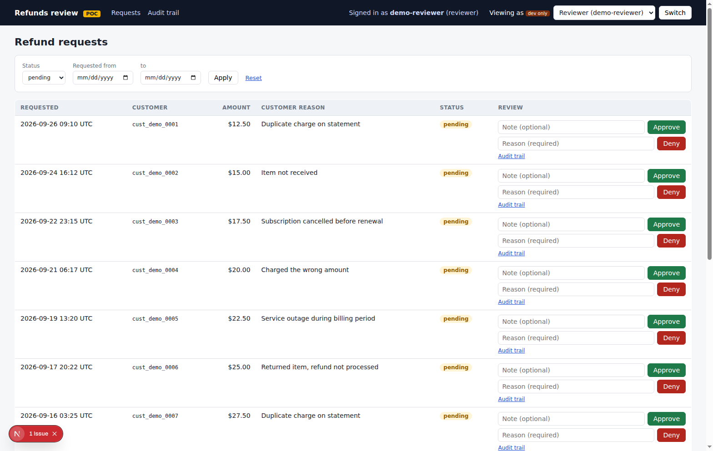

# devin-fintech-demo — internal tools

Shared audit logging and role checks for internal fintech tools. Platform-owned
core apps in `apps/` expose published APIs for employee-built tools in
`team-apps/`. The [refunds review dashboard](apps/refunds-dashboard/README.md)
is the first core app and [its versioned refunds API](apps/refunds-dashboard/README.md#team-app-api-apiv1refunds)
is the first published contract. A KYC checker and a feature-flag enabler are
**planned**; neither is implemented here yet.

This is a proof of concept with synthetic data, not a production deployment.
See [PLAYBOOK.md](PLAYBOOK.md#5-whats-explicitly-out-of-scope-for-this-poc) and
the [dashboard's production gaps](apps/refunds-dashboard/README.md#out-of-scope).

## Layout

```
packages/audit-log       @acme/audit-log          append-only audit records
packages/auth-guard      @acme/auth-guard         mock role-based access checks
apps/refunds-dashboard   @acme/refunds-dashboard  refunds review UI and API
team-apps/*              configured workspace for team-owned tools
scripts/                 CI helper scripts
.github/                 quality-gate workflow, CODEOWNERS, removed-workspaces.json
```

## Build a team tool or add a core use case

Team tools call a core app's **versioned API** from their server, keep their
own data and audit their own local changes. They do not import core app code
or query its database. For refunds, the published contract is
`GET /api/v1/refunds` and `POST /api/v1/refunds/:id/approve|deny`; the
dashboard's older unversioned routes are for its own UI. See the
[team-app workflow](PLAYBOOK.md#6-building-or-migrating-a-team-app) for setup,
identity forwarding, tests and migration checks, and the
[refunds API reference](apps/refunds-dashboard/README.md#team-app-api-apiv1refunds)
for request/response details.

If a team needs data or an action the published contract does not provide,
request a platform-owned API change first. The [core-app workflow](PLAYBOOK.md#1-adding-a-platform-owned-core-app)
covers new apps and API design; [AGENTS.md](AGENTS.md) defines the ownership
boundary for both people and agents.

## Refunds dashboard at a glance

The [dashboard](apps/refunds-dashboard/README.md) lets a reviewer or admin:

- Filter synthetic refund requests by status and requested date.
- Approve with an optional note or deny with a required reason; a request can
  leave pending only once.
- Inspect an audit trail for each decision. The UI and API share role checks and
  service logic; customer IDs and amounts are encrypted in the local SQLite DB.



In development, use **Viewing as** to switch between reviewer, admin and no
role. This is mock auth, not a sign-in system. See the [dashboard setup and API
guide](apps/refunds-dashboard/README.md#setup) for the key, seed data and API
examples.

## Getting started

Use Node 22 (`.nvmrc`; install it with `nvm install` if needed). Corepack uses
the pinned `pnpm@12.6.0` in `package.json`: an older global pnpm may reject the
lockfile as incompatible.

```bash
nvm use
corepack enable
pnpm install --frozen-lockfile
pnpm lint && pnpm typecheck && pnpm test
```

To run the app, [set its encryption key and seed the local
database](apps/refunds-dashboard/README.md#setup), then run
`pnpm --filter @acme/refunds-dashboard dev`. Useful scripts:
`pnpm test:ci` (all tests + per-package baseline guard),
`pnpm --filter @acme/audit-log test` (single package). `pnpm test` runs each
workspace package's suite through Turborepo, writing `<package>/test-results.json`;
it also runs the CI helper tests in `scripts/` (not a workspace package) as
the cached root task `//#test:scripts` (`pnpm test:scripts` runs them alone).
`pnpm test:ci` runs `turbo run test`, then checks every package against its own
`test-baseline.json`.
Coverage is not collected in CI; `pnpm vitest run --coverage` reports it
locally for `packages/*` only. Scaffold new team apps with
`pnpm create-team-app <name>` (scripts, tsconfig, Vitest and a seeded
`test-baseline.json` included); see the
[playbook](PLAYBOOK.md#adding-a-team-app).

## Build caching

`pnpm lint`, `pnpm typecheck` and `pnpm test` run `turbo run <task>`, which
runs each workspace package's script of the same name and caches the result
in `.turbo/` (gitignored). Rerunning with unchanged inputs replays the cached
logs (`FULL TURBO`). A package's hash covers its own tracked files, the hashes
of the dependency tasks in `turbo.json` (`test`, `build` and `typecheck` depend
on `^typecheck`, so editing `packages/audit-log` reruns the dashboard's
typecheck, test and build), and the `globalDependencies`: `tsconfig.base.json`,
`eslint.config.mjs`, `vitest.config.ts`, `pnpm-lock.yaml`, `.nvmrc` and
`.github/workflows/**`. Changing any of those invalidates every task. Root
files (`scripts/`, root configs) and all of `team-apps/` are linted by the
`//#lint:root` task, so the team-app import boundary holds even for a team app
without a `lint` script. Every package's `lint` depends on `//#lint:root` and
every `test` on `//#test:scripts`, so a change under `scripts/` or `team-apps/`
reruns all `lint` tasks, and a change under `scripts/` reruns all `test` tasks.
Use `pnpm turbo run <task> --force` to bypass the cache.

CI runs the whole graph unfiltered on every PR; there is no affected-package
filtering. Unchanged packages replay their cached logs and their cached
`test-results.json` (a declared `test` output), while changed packages and
their dependents rerun, so the baseline guard always sees every package.
Correctness never depends on the cache: a cold or missing cache reruns
everything and only costs time. Only trusted runs write the cache: pushes to
`main` save `.turbo/` with `actions/cache/save` (key: OS + `pnpm-lock.yaml` hash
+ commit SHA), and PRs only restore it (falling back to the newest `main` entry
for the same lockfile, then any lockfile). A nightly `nightly-full` workflow
reruns everything on `main` with `--force` as a safety net against a bad cache
entry or an undeclared input.

## Decisions

- **pnpm workspaces with Turborepo for task caching.** Turborepo only
  orchestrates and caches `lint`, `typecheck`, `test` and `build`; pnpm still
  owns installs and workspace linking. See [Build caching](#build-caching).
- **No build step for shared packages.** Each package's `exports` and `types`
  point at `./src/index.ts`; apps depend on them with `"workspace:*"`. A Next.js
  app must therefore list `@acme/audit-log` and `@acme/auth-guard` in
  `transpilePackages` in its `next.config.mjs`. CI builds the refunds dashboard.
- **TypeScript `strict: true` everywhere**, Vitest with a `vitest.config.ts` per
  package (the root one adds the `scripts` project and coverage), ESLint flat config
  (`eslint.config.mjs`) with typescript-eslint `recommended`.

## Quality gate

Every PR (against any branch) and every push to `main` runs one
`pnpm turbo run lint typecheck test build` across all workspace packages
(cached; see [Build caching](#build-caching)), then a **per-package
test-count ratchet**. The same runs nightly on `main` with the cache bypassed. It fails if a package's passing-test count does not
exactly match `minPassedTests` in its own `test-baseline.json`, if that value
is below the one on the base branch, if a package with tests has no baseline
or a baseline is deleted, or if any test is skipped, todo or failing. Teams
raise their own package's baseline in the PR that adds the tests. See [PLAYBOOK.md](PLAYBOOK.md#4-what-the-quality-gate-checks-and-how-to-update-the-test-baseline)
and [AGENTS.md](AGENTS.md).

## Manual repository admin steps

1. Replace the placeholder team `@acme-org/security-reviewers` in
   `.github/CODEOWNERS` with a real GitHub team that has write access to this
   repository. Until then GitHub reports an "unknown owner" error for it.
2. In branch protection for the default branch, turn on **Require review from
   Code Owners** and make the **quality-gate** check **required**.
